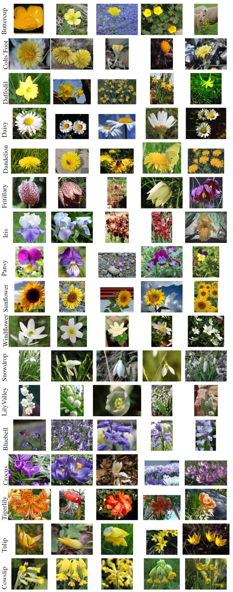

# Transfer Learning: Fine-tuning Networks

Transfer learning: ability to use a pre-trained model as a "shortcut" to learn patterns from data it was not originally trained on.

There are two types of transfer learning in the context of deep learning:

1. Transfer learning via feature extraction
2. **Transfer learning via fine-tuning**: modify the architecture of a network so we can re-train parts of the network

This repo will focus on the second method of transfer learning

## Datasets

### Flowers-17

Pictures of 17 category flower dataset with 80 images for each class. [Dataset](http://www.robots.ox.ac.uk/~vgg/data/flowers/17/) was collected by the Visual Geometry Group at the University of Oxford.



## Technologies

* [keras](https://keras.io)
* [tensorflow](https://www.tensorflow.org/)
* [scikit-learn](https://scikit-learn.org/)
  
## Deployment with Docker

1. Build the docker image:
```
$ cd docker
$ make build
```

2. Create a docker container based on the image:
```
$ make run
```

3. SSH to the docker container:
```
$ make dev
```

4. Show NN architecture (indexes and layers): 
```
$ python src/inspect_model.py
[INFO] showing layers...
[INFO] 0	InputLayer
[INFO] 1	Conv2D
[INFO] 2	Conv2D
[INFO] 3	MaxPooling2D
[INFO] 4	Conv2D
[INFO] 5	Conv2D
[INFO] 6	MaxPooling2D
[INFO] 7	Conv2D
[INFO] 8	Conv2D
[INFO] 9	Conv2D
[INFO] 10	MaxPooling2D
[INFO] 11	Conv2D
[INFO] 12	Conv2D
[INFO] 13	Conv2D
[INFO] 14	MaxPooling2D
[INFO] 15	Conv2D
[INFO] 16	Conv2D
[INFO] 17	Conv2D
[INFO] 18	MaxPooling2D
[INFO] 19	Flatten
[INFO] 20	Dense
[INFO] 21	Dense
[INFO] 22	Dense

$ python src/inspect_model.py --include-top 0
[INFO] showing layers...
[INFO] 0	InputLayer
[INFO] 1	Conv2D
[INFO] 2	Conv2D
[INFO] 3	MaxPooling2D
[INFO] 4	Conv2D
[INFO] 5	Conv2D
[INFO] 6	MaxPooling2D
[INFO] 7	Conv2D
[INFO] 8	Conv2D
[INFO] 9	Conv2D
[INFO] 10	MaxPooling2D
[INFO] 11	Conv2D
[INFO] 12	Conv2D
[INFO] 13	Conv2D
[INFO] 14	MaxPooling2D
[INFO] 15	Conv2D
[INFO] 16	Conv2D
[INFO] 17	Conv2D
[INFO] 18	MaxPooling2D
```

5. Fine-tuning:
```

```

...

## Resources

* Deep Learning for Computer Vision with Python by Dr. Adrian Rosebrock: https://www.pyimagesearch.com/deep-learning-computer-vision-python-book/
